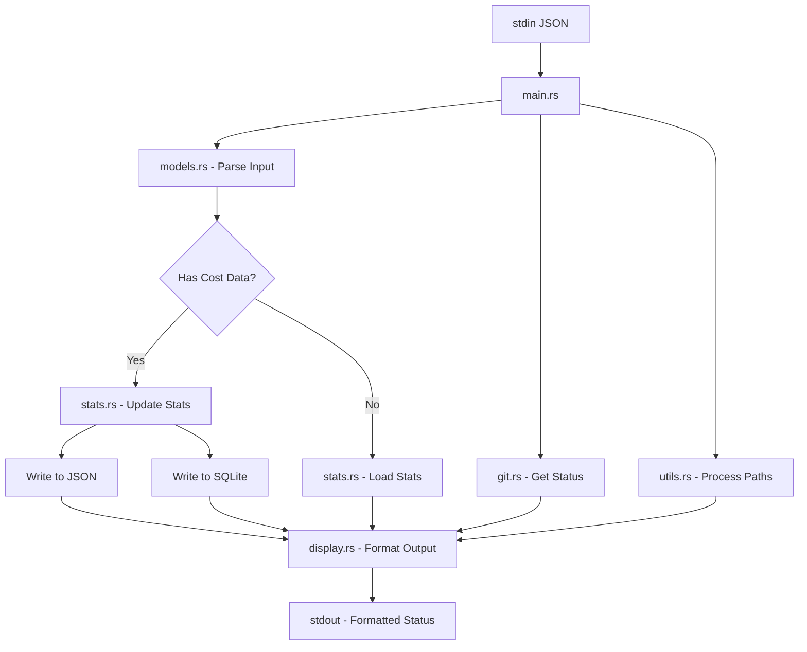

# Claudia Statusline - Architecture Documentation

## Overview

Claudia Statusline is a high-performance Rust-based statusline for Claude Code, featuring a clean modular architecture with persistent stats tracking, git integration, and intelligent context awareness.

## Module Structure

The codebase follows a modular architecture with clear separation of concerns:

```
src/
├── main.rs          (175 lines)  - Application entry, Clap CLI, logging init
├── models.rs        (293 lines)  - Data structures and type definitions
├── git.rs           (230 lines)  - Git repository operations
├── git_utils.rs     (54 lines)   - Simple git status utility
├── stats.rs         (520 lines)  - SQLite-first reads with JSON backup writes
├── display.rs       (337 lines)  - Output formatting with theme support
├── utils.rs         (420 lines)  - Utilities with security validation
├── version.rs       (169 lines)  - Version information and build metadata
├── database.rs      (480 lines)  - SQLite operations with connection pooling
├── migrations/
│   └── mod.rs       (222 lines)  - Database migration framework
├── error.rs         (100 lines)  - Unified error handling with thiserror
├── retry.rs         (290 lines)  - Retry logic with exponential backoff
├── config.rs        (475 lines)  - TOML config with theme support
├── common.rs        (85 lines)   - Shared utilities (timestamps, paths)
└── lib.rs           (55 lines)   - Public API surface
```

Total: ~3,705 lines across 14 focused modules (average ~265 lines each)

## Module Responsibilities

### `main.rs` - Application Entry Point
- Initializes structured logging with env_logger
- Parses CLI arguments with clap
- Reads JSON input from stdin
- Orchestrates data flow between modules
- Handles early exit conditions
- Manages stats updates
- **Key Functions:**
  - `main()` - Application entry point with logging and CLI handling

### `models.rs` - Data Models
- Defines all data structures used throughout the application
- Handles JSON deserialization with serde
- Provides model type detection and conversion
- **Key Types:**
  - `StatuslineInput` - Main input structure from Claude
  - `Workspace`, `Model`, `Cost` - Input components
  - `ModelType` - Enum for Claude model variants
  - `ContextUsage` - Context window usage tracking
  - `Message`, `TranscriptEntry` - Transcript parsing

### `git.rs` - Git Integration
- Executes git commands safely
- Parses git status output
- Formats git information for display
- **Key Functions:**
  - `get_git_status()` - Retrieves repository status
  - `parse_git_status()` - Parses git output
  - `format_git_info()` - Formats status for display

### `stats.rs` - Statistics Management
- Manages persistent stats storage with dual-write capability
- Tracks costs across sessions
- Implements XDG-compliant file storage
- Provides atomic file operations
- SQLite-first reads with JSON backup writes (v2.7.0)
- **Key Components:**
  - `StatsData` - Main stats structure
  - `SessionStats`, `DailyStats`, `MonthlyStats` - Aggregation levels
  - Process-safe file locking with fs2
  - Thread-safe global state management
  - Dual-write to SQLite for concurrent access

### `display.rs` - Output Formatting
- Handles all visual formatting
- Manages ANSI color codes with theme support
- Creates progress bars and visual elements
- Implements cost color coding
- Supports light/dark themes via environment variables
- **Key Functions:**
  - `format_output()` - Main formatting orchestrator (prints to stdout)
  - `format_output_to_string()` - Library-friendly formatter that returns a String
  - `format_context_bar()` - Progress bar generation
  - `get_cost_color()` - Cost-based color selection
  - `format_duration()` - Time formatting
  - `Colors::text_color()` - Theme-aware text color
  - `Colors::separator_color()` - Theme-aware separator color

### `utils.rs` - Utility Functions
- Path manipulation and shortening
- Context usage calculation with security validation
- Transcript parsing with file size limits
- Duration extraction
- Case-insensitive extension validation
- **Key Functions:**
  - `shorten_path()` - Home directory substitution
  - `calculate_context_usage()` - Token estimation
  - `parse_duration()` - Extract session duration
  - `validate_transcript_file()` - Security validation (10MB limit, .jsonl only)

### `version.rs` - Version Information
- Compile-time version injection
- Git commit information
- Build metadata (date, profile, rustc)
- Version string formatting
- **Key Components:**
  - `VersionInfo` - Version data structure
  - `version_string()` - Full version output
  - `short_version()` - Compact version format
  - Build-time environment variables

### `database.rs` - SQLite Database Layer
- Manages SQLite database operations
- Implements schema creation and management
- Provides CRUD operations for stats data
- Enables WAL mode for concurrent access
- **Key Features:**
  - Atomic transactions
  - UPSERT operations for accumulating values
  - 10-second busy timeout for concurrent access
  - Session duration tracking
  - Daily and monthly aggregations

### `migrations/mod.rs` - Migration Framework
- Handles database schema versioning
- Provides up/down migration support
- Tracks applied migrations
- Supports automatic JSON to SQLite migration
- **Key Components:**
  - `Migration` trait for defining migrations
  - `MigrationRunner` for executing migrations
  - Version tracking and checksums
  - Rollback capability

## Data Flow



## Key Design Decisions

### 1. Modular Architecture
- **Decision:** Split monolithic code into focused modules
- **Rationale:** Improves maintainability, testability, and code organization
- **Benefits:** Easier navigation, parallel development, clear responsibilities

### 2. XDG Compliance
- **Decision:** Store stats in `$XDG_DATA_HOME/claudia-statusline/`
- **Rationale:** Follow Linux desktop standards
- **Files:**
  - `stats.db` - SQLite database (primary storage) with WAL mode
  - `stats.json` - JSON backup for compatibility (will be removed in v3.0.0)
- **Fallback:** `~/.local/share/claudia-statusline/`

### 3. Smart Persistence
- **Decision:** Save all stats updates immediately (v2.1.3+)
- **Rationale:** Ensure data integrity for concurrent access
- **Implementation:** Dual-write to JSON and SQLite
- **Concurrency:** Process-safe file locking (fs2) and SQLite WAL mode

### 4. Direct Binary Execution
- **Decision:** No wrapper scripts needed (except debug mode)
- **Rationale:** Simplifies deployment and reduces overhead
- **Benefits:** Faster execution, fewer moving parts

### 5. Atomic File Operations
- **Decision:** Write to temp file, then atomic rename
- **Rationale:** Prevent data corruption during writes
- **Implementation:** `stats.rs` - save() method

### 6. Structured Logging
- **Decision:** Use `log` crate with env_logger instead of eprintln!
- **Rationale:** Professional logging with configurable levels
- **Default:** WARN level to reduce stderr noise
- **Configuration:** RUST_LOG environment variable

### 7. Theme Support
- **Decision:** Support CLAUDE_THEME and STATUSLINE_THEME env vars
- **Rationale:** Better readability in different terminal themes
- **Implementation:** Theme-aware color functions in display.rs
- **Fallback:** Default to dark theme

### 8. SQLite-First Storage (v2.7.0)
- **Decision:** SQLite-first reads with JSON backup writes
- **Rationale:** Better concurrent access, ACID transactions, performance
- **Phase 1:** Dual-write to both (v2.2.0) ✅
- **Phase 2:** SQLite-first reads, JSON backup writes (v2.7.0) ✅ CURRENT
- **Phase 3:** SQLite only, remove JSON (v3.0.0) 🔜 PLANNED

## Testing Strategy

### Unit Tests (39 tests)
Each module contains its own unit tests:
- `models.rs` - JSON parsing, type detection
- `git.rs` - Status parsing, formatting
- `stats.rs` - Persistence, aggregation, file locking
- `display.rs` - Formatting, color selection
- `utils.rs` - Path handling, context calculation
- `version.rs` - Version info creation, formatting
- `database.rs` - SQLite operations, transactions
- `migrations/mod.rs` - Migration execution

### Integration Tests (17 tests)
Located in:
- `tests/integration_tests.rs` - Binary execution, JSON handling
- `tests/sqlite_integration_tests.rs` - SQLite concurrency, dual-write
  - Concurrent access testing
  - WAL mode verification
  - Transaction rollback
  - UPSERT behavior
  - Migration testing

## Performance Characteristics

- **Binary Size:** ~2.6MB (includes bundled SQLite)
- **Execution Time:** ~5-10ms average
- **Memory Usage:** ~3MB resident
- **Test Execution:** <2 seconds for all tests (56 total)
- **Database Overhead:** <5ms per operation

### Optimization Flags
```toml
[profile.release]
opt-level = 3      # Maximum optimization
lto = true         # Link-time optimization
codegen-units = 1  # Single codegen unit
strip = true       # Strip symbols
```

## Color Scheme

The application uses ANSI color codes for terminal output:

| Color | Code | Usage |
|-------|------|-------|
| Cyan | `\x1b[36m` | Directory paths, model names |
| Green | `\x1b[32m` | Git branch, added files, low cost (<$5) |
| Yellow | `\x1b[33m` | Modified files, medium cost ($5-20) |
| Red | `\x1b[31m` | Deleted files, high cost (≥$20), critical context |
| Orange | `\x1b[38;5;208m` | Warning context (>70%) |
| Gray | `\x1b[90m` | Separators, secondary info |
| Light Gray | `\x1b[38;5;245m` | Duration, bullets |

## Error Handling

- **Graceful Degradation:** Missing fields use defaults
- **Safe Git Operations:** Validates directory existence
- **Atomic File Writes:** Prevents corruption
- **JSON Parsing:** Falls back to empty input on error

## Security Considerations

- **No Command Injection:** Uses `Command::arg()` for safe argument passing
- **Path Validation:** Checks directory existence before operations
- **File Permissions:** Stats file created with user-only access
- **No Unsafe Code:** Pure safe Rust throughout
- **Transcript Validation:** Case-insensitive .jsonl extension check
- **Size Limits:** 10MB max file size to prevent memory exhaustion
- **Structured Logging:** Sensitive data never logged

## Future Enhancements

### Phase 3 Migration (v3.0.0)
1. **SQLite-only storage** - Remove JSON writing entirely
2. **Migration cleanup** - Remove JSON fallback code
3. **Performance optimization** - Direct database queries only

### Potential Improvements
1. **Configurable Context Window** - User-defined limits per model
2. **Plugin System** - Extensible status components
3. **Git status caching** - Reduce repeated git calls
4. **Advanced themes** - Full color customization

## Embedding API (v2.12.0)

The statusline library can be embedded in other Rust applications through its public API. This enables other tools (like Codex) to leverage the statusline functionality without spawning a separate process.

### Core Functions

#### `render_statusline(input: &StatuslineInput, update_stats: bool) -> Result<String>`
Primary function for embedding the statusline in other applications.

**Parameters:**
- `input`: StatuslineInput containing workspace and model information
- `update_stats`: Whether to update persistent statistics (false for preview mode)

**Returns:** Formatted statusline string ready for display

Note: When `update_stats=true` and a `session_id` is provided, persistent stats are updated (SQLite/JSON per configuration). The library honors `NO_COLOR` and theme/environment configuration like the CLI.

#### `render_from_json(json: &str, update_stats: bool) -> Result<String>`
Convenience function that parses JSON input and calls `render_statusline`.

**Parameters:**
- `json`: JSON string containing statusline input
- `update_stats`: Whether to update persistent statistics

**Returns:** Formatted statusline string ready for display

### Example Usage

```rust
use statusline::{render_statusline, StatuslineInput, Workspace, Model};

// Using structured input
let input = StatuslineInput {
    workspace: Some(Workspace {
        current_dir: Some("/home/user/project".to_string()),
    }),
    model: Some(Model {
        display_name: Some("Claude 3.5 Sonnet".to_string()),
    }),
    ..Default::default()
};

let output = render_statusline(&input, false)?;
println!("{}", output);
```

### Integration Guidelines

1. **Add dependency** to Cargo.toml:
   ```toml
   statusline = "2.12.0"
   ```

2. **Import functions**:
   ```rust
   use statusline::{render_from_json, render_statusline};
   ```

3. **Choose update mode**:
   - `update_stats=true`: Updates persistent statistics (production use)
   - `update_stats=false`: Preview mode, no persistent changes (testing)

4. **Error handling**: All functions return `Result<String, StatuslineError>`

### Testing

The embedding API includes comprehensive test coverage:
- Basic rendering functionality
- JSON input parsing
- Cost display and formatting
- Git repository integration
- NO_COLOR environment variable support
- Context usage calculations
- Error handling for invalid inputs

See `tests/lib_api_tests.rs` and `examples/embedding_example.rs` for complete usage examples.

## Development Guidelines

### Adding New Features
1. Identify the appropriate module for the feature
2. Add unit tests in the same module
3. Update integration tests if needed
4. Document new public APIs
5. Update this architecture document

### Code Style
- Use `rustfmt` for consistent formatting
- Keep functions focused and small
- Prefer composition over inheritance
- Document public interfaces
- Write tests for new functionality

## Module Dependencies

```
main.rs
├── models.rs
├── stats.rs
├── display.rs
│   ├── models.rs
│   ├── git.rs
│   └── utils.rs
└── utils.rs
    └── models.rs
```

## Build System

### Makefile Targets
- `make build` - Build release binary
- `make test` - Run all tests
- `make clean` - Remove build artifacts
- `make install` - Install to ~/.local/bin

### Cargo Commands
- `cargo build --release` - Production build
- `cargo test` - Run all tests
- `cargo fmt` - Format code
- `cargo clippy` - Lint code

---

*Last Updated: August 29, 2025 (v2.7.0)*
