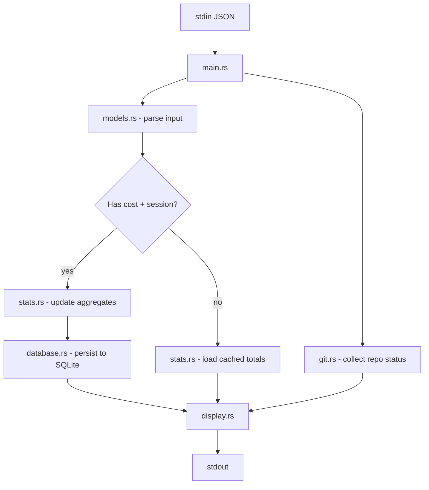

# Claudia Statusline - Architecture

## Overview
Claudia Statusline is a Rust CLI and embeddable library that renders a richer status line for Claude Code sessions. The binary ingests JSON over stdin, enriches it with git and persistent usage data, and writes a pre-formatted line to stdout. The workspace keeps shared logic under `src/lib.rs` so the CLI and library can share the same building blocks.

## Workspace Layout
- `src/main.rs` – CLI entry point, Clap command definitions, high level orchestration
- `src/lib.rs` – public API surface for embedding (`render_statusline`, `render_from_json`)
- `src/common.rs` – helpers for timestamps, device IDs, and path discovery (XDG locations)
- `src/config.rs` – configuration loading/merging, defaults, retry settings, theme resolution
- `src/context_learning.rs` – adaptive context window learning (experimental, opt-in)
- `src/database.rs` – SQLite backend (schema creation, CRUD helpers, maintenance utilities)
- `src/display.rs` – formatting helpers, color palette, context bar rendering
- `src/error.rs` – shared error type built on `thiserror`
- `src/git.rs` / `src/git_utils.rs` – git status collection with timeout-aware subprocess helpers
- `src/models.rs` – serde-ready data structures for JSON input and transcripts
- `src/retry.rs` – reusable retry/backoff primitives for transient failures
- `src/stats.rs` – persistent stats tracking (JSON fallback, SQLite primary store)
- `src/theme.rs` – theme system with TOML-based configuration and color resolution
- `src/utils.rs` – path shortening, input sanitisation, transcript parsing, duration helpers
- `src/version.rs` – build metadata exposed through `--version` and library helpers
- `src/sync.rs` – cloud sync implementation (compiled when the `turso-sync` feature is enabled)
- `src/migrations/mod.rs` – migration framework for evolving the local schema

Tests live alongside the binary in `tests/` (`integration_tests.rs`, `sqlite_integration_tests.rs`, `db_maintenance_tests.rs`, `lib_api_tests.rs`, `proptest_tests.rs`). Examples for the sync feature are under `examples/`.

## Data Flow


When compiled with `turso-sync`, the optional sync subcommand pulls data from `stats.rs`/`database.rs`, performs network I/O via `sync.rs`, and merges results back through the same persistence layer.

## Key Design Choices
- **Safe Rust only** – the crate avoids `unsafe` blocks, favouring explicit `Result` flows.
- **SQLite-first storage** – reads and writes go through SQLite. JSON is retained for backward compatibility and migration tooling, but can be disabled via config or `statusline migrate --finalize`.
- **XDG-aware paths** – data, config, and cache directories respect `$XDG_*` with sensible fallbacks on macOS/Windows.
- **Resilient git integration** – git subprocesses run with timeouts, explicit args, and sanitised output to defend against malicious repos.
- **Composable library API** – formatting logic is exposed through `render_statusline`/`render_from_json` so third parties can reuse the renderer without shelling out.
- **Adaptive context learning** (experimental) – learns actual context limits by observing compaction events, with priority: user overrides > learned values > intelligent defaults > global fallback.

## Storage & Configuration
- Config: `~/.config/claudia-statusline/config.toml` (or `$XDG_CONFIG_HOME`)
- Data: `~/.local/share/claudia-statusline/stats.db` with optional `stats.json`
- Cache/logs: `~/.cache/statusline-debug.log` when debug logging is enabled

`config.rs` merges values in order: CLI flags → environment variables → user config file → built-in defaults.

## Testing Strategy
- **Unit tests** are embedded in most modules (sanitisation, retry logic, stats calculations, git parsing, etc.).
- **Property tests** in `tests/proptest_tests.rs` cover transcript parsing and numeric boundaries.
- **Integration tests** exercise CLI flows (`tests/integration_tests.rs`) and library APIs (`tests/lib_api_tests.rs`).
- **Database & maintenance tests** (`tests/sqlite_integration_tests.rs`, `tests/db_maintenance_tests.rs`) validate persistence, WAL settings, pruning logic, and CLI exit codes.

Run `make test` (all unit + integration) or `make test-sqlite` to focus on the SQLite suite. Property tests respect the regressions file committed under `tests/`.

## Build & Performance Notes
`Cargo.toml` tunes the release profile for a small, static binary:
```toml
[profile.release]
opt-level = "z"
lto = true
codegen-units = 1
strip = true
panic = "abort"
```
The `Makefile` wraps common flows (`make debug`, `make release`, `make dev`, `make check-code`). In practice the hot path completes in a few milliseconds and the CLI stays CPU-light because most work is simple parsing, small SQLite transactions, and a short git status command.

## Color Palette
`display.rs` centralises the ANSI palette and honours `NO_COLOR`/theme settings.

| Semantic element | Dark theme | Light theme |
|------------------|-----------|-------------|
| Directory, model, separators | cyan (`\x1b[36m`) / light gray (`\x1b[38;5;245m`) | cyan / gray (`\x1b[90m`)
| Git branch & added lines | green (`\x1b[32m`) | green |
| Removed lines & critical cost | red (`\x1b[31m`) | red |
| Medium cost / caution | yellow (`\x1b[33m`) | yellow |
| Context warning | orange (`\x1b[38;5;208m`) | orange |
| Default text | white (`\x1b[37m`) | gray (`\x1b[90m`)

Themes are selectable via `STATUSLINE_THEME`/`CLAUDE_THEME`, or `--theme` on the CLI.

## Error Handling & Resilience
- Central `StatuslineError` enumerates IO, database, git, sync, and serde failures.
- `retry.rs` wraps transient operations (database, filesystem, git, network) with exponential backoff tuned from config defaults.
- Transcript and path handling sanitises control characters, enforces extensions/size limits, and canonicalises directories before use.
- Git commands use `Command::arg` exclusively to avoid injection.

## Embedding API
`src/lib.rs` exposes two helpers for consumers:
- `render_statusline(input: &StatuslineInput, update_stats: bool) -> Result<String>` – formats a status line from structured data.
- `render_from_json(json: &str, update_stats: bool) -> Result<String>` – convenience wrapper that parses JSON then delegates to `render_statusline`.

Both honour configuration sources, update persistent stats when requested, and reuse the same formatter as the CLI.
