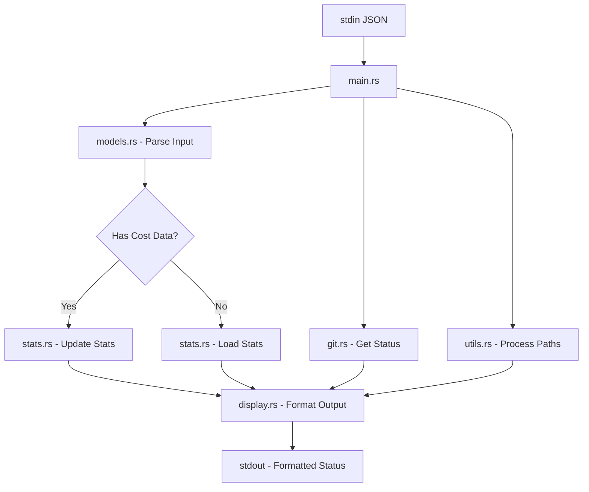

# Claudia Statusline - Architecture Documentation

## Overview

Claudia Statusline is a high-performance Rust-based statusline for Claude Code, featuring a clean modular architecture with persistent stats tracking, git integration, and intelligent context awareness.

## Module Structure

The codebase follows a modular architecture with clear separation of concerns:

```
src/
├── main.rs       (110 lines)  - Application entry point, CLI args, orchestration
├── models.rs     (128 lines)  - Data structures and type definitions
├── git.rs        (153 lines)  - Git repository operations
├── stats.rs      (295 lines)  - Persistent statistics tracking
├── display.rs    (261 lines)  - Output formatting and presentation
├── utils.rs      (121 lines)  - Utility functions and helpers
└── version.rs    (102 lines)  - Version information and build metadata
```

Total: ~1,170 lines of well-organized, maintainable code

## Module Responsibilities

### `main.rs` - Application Entry Point
- Handles CLI arguments (--version, --help)
- Reads JSON input from stdin
- Orchestrates data flow between modules
- Handles early exit conditions
- Manages stats updates
- **Key Functions:**
  - `main()` - Application entry point with CLI handling

### `models.rs` - Data Models
- Defines all data structures used throughout the application
- Handles JSON deserialization with serde
- Provides model type detection and conversion
- **Key Types:**
  - `StatuslineInput` - Main input structure from Claude
  - `Workspace`, `Model`, `Cost` - Input components
  - `ModelType` - Enum for Claude model variants
  - `ContextUsage` - Context window usage tracking
  - `Message`, `TranscriptEntry` - Transcript parsing

### `git.rs` - Git Integration
- Executes git commands safely
- Parses git status output
- Formats git information for display
- **Key Functions:**
  - `get_git_status()` - Retrieves repository status
  - `parse_git_status()` - Parses git output
  - `format_git_info()` - Formats status for display

### `stats.rs` - Statistics Management
- Manages persistent stats storage
- Tracks costs across sessions
- Implements XDG-compliant file storage
- Provides atomic file operations
- **Key Components:**
  - `StatsData` - Main stats structure
  - `SessionStats`, `DailyStats`, `MonthlyStats` - Aggregation levels
  - Smart caching with write thresholds
  - Thread-safe global state management

### `display.rs` - Output Formatting
- Handles all visual formatting
- Manages ANSI color codes
- Creates progress bars and visual elements
- Implements cost color coding
- **Key Functions:**
  - `format_output()` - Main formatting orchestrator
  - `format_context_bar()` - Progress bar generation
  - `get_cost_color()` - Cost-based color selection
  - `format_duration()` - Time formatting

### `utils.rs` - Utility Functions
- Path manipulation and shortening
- Context usage calculation
- Transcript parsing
- Duration extraction
- **Key Functions:**
  - `shorten_path()` - Home directory substitution
  - `calculate_context_usage()` - Token estimation
  - `parse_duration()` - Extract session duration

### `version.rs` - Version Information
- Compile-time version injection
- Git commit information
- Build metadata (date, profile, rustc)
- Version string formatting
- **Key Components:**
  - `VersionInfo` - Version data structure
  - `version_string()` - Full version output
  - `short_version()` - Compact version format
  - Build-time environment variables

## Data Flow



## Key Design Decisions

### 1. Modular Architecture
- **Decision:** Split monolithic code into focused modules
- **Rationale:** Improves maintainability, testability, and code organization
- **Benefits:** Easier navigation, parallel development, clear responsibilities

### 2. XDG Compliance
- **Decision:** Store stats in `$XDG_DATA_HOME/claudia-statusline/stats.json`
- **Rationale:** Follow Linux desktop standards
- **Fallback:** `~/.local/share/claudia-statusline/stats.json`

### 3. Smart Persistence
- **Decision:** Only save stats on significant changes (>$0.10 or 10 minutes)
- **Rationale:** Minimize disk I/O while maintaining data integrity
- **Implementation:** In-memory caching with conditional writes

### 4. Direct Binary Execution
- **Decision:** No wrapper scripts needed (except debug mode)
- **Rationale:** Simplifies deployment and reduces overhead
- **Benefits:** Faster execution, fewer moving parts

### 5. Atomic File Operations
- **Decision:** Write to temp file, then atomic rename
- **Rationale:** Prevent data corruption during writes
- **Implementation:** `stats.rs` - save() method

## Testing Strategy

### Unit Tests (27 tests)
Each module contains its own unit tests:
- `models.rs` - JSON parsing, type detection
- `git.rs` - Status parsing, formatting
- `stats.rs` - Persistence, aggregation
- `display.rs` - Formatting, color selection
- `utils.rs` - Path handling, context calculation
- `version.rs` - Version info creation, formatting

### Integration Tests (14 tests)
Located in `tests/integration_tests.rs`:
- End-to-end binary execution
- JSON input handling
- Error scenarios
- Unicode support
- CLI arguments (--version, -v, --help, -h)
- ANSI color output verification

## Performance Characteristics

- **Binary Size:** ~702KB (release optimized)
- **Execution Time:** ~5ms average
- **Memory Usage:** ~2MB resident
- **Test Execution:** <1 second for all tests

### Optimization Flags
```toml
[profile.release]
opt-level = 3      # Maximum optimization
lto = true         # Link-time optimization
codegen-units = 1  # Single codegen unit
strip = true       # Strip symbols
```

## Color Scheme

The application uses ANSI color codes for terminal output:

| Color | Code | Usage |
|-------|------|-------|
| Cyan | `\x1b[36m` | Directory paths, model names |
| Green | `\x1b[32m` | Git branch, added files, low cost (<$5) |
| Yellow | `\x1b[33m` | Modified files, medium cost ($5-20) |
| Red | `\x1b[31m` | Deleted files, high cost (≥$20), critical context |
| Orange | `\x1b[38;5;208m` | Warning context (>70%) |
| Gray | `\x1b[90m` | Separators, secondary info |
| Light Gray | `\x1b[38;5;245m` | Duration, bullets |

## Error Handling

- **Graceful Degradation:** Missing fields use defaults
- **Safe Git Operations:** Validates directory existence
- **Atomic File Writes:** Prevents corruption
- **JSON Parsing:** Falls back to empty input on error

## Security Considerations

- **No Command Injection:** Uses `Command::arg()` for safe argument passing
- **Path Validation:** Checks directory existence before operations
- **File Permissions:** Stats file created with user-only access
- **No Unsafe Code:** Pure safe Rust throughout

## Future Enhancements

### Planned Improvements
1. **Async Git Operations** - Non-blocking repository checks
2. **Configurable Context Window** - User-defined limits
3. **Plugin System** - Extensible status components
4. **Performance Metrics** - Built-in profiling

### Potential Modules
- `config.rs` - User configuration management
- `cache.rs` - Git status caching layer
- `metrics.rs` - Performance monitoring
- `plugins.rs` - Extension system

## Development Guidelines

### Adding New Features
1. Identify the appropriate module for the feature
2. Add unit tests in the same module
3. Update integration tests if needed
4. Document new public APIs
5. Update this architecture document

### Code Style
- Use `rustfmt` for consistent formatting
- Keep functions focused and small
- Prefer composition over inheritance
- Document public interfaces
- Write tests for new functionality

## Module Dependencies

```
main.rs
├── models.rs
├── stats.rs
├── display.rs
│   ├── models.rs
│   ├── git.rs
│   └── utils.rs
└── utils.rs
    └── models.rs
```

## Build System

### Makefile Targets
- `make build` - Build release binary
- `make test` - Run all tests
- `make clean` - Remove build artifacts
- `make install` - Install to ~/.local/bin

### Cargo Commands
- `cargo build --release` - Production build
- `cargo test` - Run all tests
- `cargo fmt` - Format code
- `cargo clippy` - Lint code

---

*Last Updated: August 24, 2025*