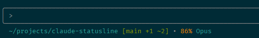

# Claudia Statusline

*Community project for Claude Code users - "Claudia" is our unofficial companion to Claude!*

A high-performance, secure, and customizable statusline for Claude Code written in Rust. Displays workspace information, git status, model usage metrics, session cost tracking, and more in your terminal.

**Version 2.9.2** - Fixed GitHub Actions security workflow and organized documentation



## Technical Highlights

- **Security Hardened** - All user inputs validated, prevents path injection attacks (v2.2.1)
- **Modular Architecture** - Clean separation across 11 focused modules (~200 lines each)
- **Comprehensive Testing** - 79 tests (52 unit + 18 integration + 9 SQLite), including security tests
- **Configuration System** - Full TOML-based configuration with sensible defaults (v2.6.0)
- **Retry Logic** - Automatic retry with exponential backoff for transient failures (v2.5.0)
- **Unified Error Handling** - Type-safe error system with thiserror (v2.4.0)
- **SQLite-First Storage** - SQLite-first reads with JSON backup writes for maximum reliability (v2.7.0+)
- **Multi-Console Safe** - Process-safe file locking and SQLite WAL mode for concurrent sessions
- **XDG Compliance** - Follows desktop standards for file locations
- **Atomic Operations** - Safe file writes prevent data corruption
- **Data Integrity** - No stats loss even with 10+ concurrent sessions
- **Type Safety** - Strong typing with zero unsafe code
- **Cross-Platform** - Automated CI/CD builds for Linux (x86_64, ARM64), macOS, and Windows

## Features

- **Smart Path Display** - Shows current directory with `~` home substitution
- **Git Integration** - Displays branch name and file status (added/modified/deleted/untracked)
- **Context Usage Tracking** - Real-time percentage with visual progress bar
- **Model Detection** - Shows current Claude model (Opus/Sonnet/Haiku)
- **Session Duration** - Tracks conversation length from transcript
- **Cost Tracking** - Displays session cost in USD with burn rate ($/hour)
- **Persistent Stats Tracking** - Accumulates costs and usage stats across sessions in XDG-compliant location
- **SQLite-First Storage** (v2.7.0+) - SQLite-first reads with JSON backup writes, automatic migration
- **Lines Changed** - Shows added/removed lines count from session
- **Progress Bars** - Visual indicators for context usage (10-char bar)
- **Burn Rate** - Shows cost per hour for active sessions
- **Concurrent Access** - Multiple Claude consoles can safely update stats simultaneously
- **Theme-Aware Colors** - Automatically adapts to dark/light terminal themes
- **Dark Mode Optimized** - Enhanced visibility for Claude's dark theme
- **High Performance** - Written in Rust for minimal overhead (~5ms execution)
- **Migration Support** - Automatic migration from JSON to SQLite with rollback capability
- **Full Source** - Complete Rust implementation with proper attribution

## Quick Start

### One-Line Install (Pre-built Binary) - Recommended
```bash
curl -fsSL https://raw.githubusercontent.com/hagan/claudia-statusline/main/scripts/quick-install.sh | bash
```

Or with wget:
```bash
wget -qO- https://raw.githubusercontent.com/hagan/claudia-statusline/main/scripts/quick-install.sh | bash
```

### Build from Source
```bash
git clone https://github.com/hagan/claudia-statusline && cd claudia-statusline && ./scripts/install-statusline.sh
```

### System Requirements

**Supported Platforms**: Linux, macOS, Unix-like systems
**Terminal**: Any terminal with ANSI color support

### Prerequisites

For **pre-built binary installation**:
- **curl** or **wget** (for downloading the installer)
- **jq** (for Claude Code configuration) - [Install jq](https://stedolan.github.io/jq/download/)

For **building from source**:
- **Rust toolchain** with Cargo (1.70+) - [Install Rust](https://www.rust-lang.org/tools/install)
- **jq** (for installer script) - [Install jq](https://stedolan.github.io/jq/download/)
- **Make** (optional, but recommended for easy building)
- **Git** (optional, for repository status features)

### Installation

#### Option 1: Pre-built Binaries (Fastest)

**Automatic Installation** (detects your OS and architecture):
```bash
curl -fsSL https://raw.githubusercontent.com/hagan/claudia-statusline/main/scripts/quick-install.sh | bash
```

**Manual Download**

Download the latest release for your platform:

| Platform | Architecture | Download |
|----------|-------------|----------|
| Linux | x86_64 | [statusline-linux-amd64.tar.gz](https://github.com/hagan/claudia-statusline/releases/latest/download/statusline-linux-amd64.tar.gz) |
| Linux | ARM64 | [statusline-linux-arm64.tar.gz](https://github.com/hagan/claudia-statusline/releases/latest/download/statusline-linux-arm64.tar.gz) |
| macOS | Intel | [statusline-darwin-amd64.tar.gz](https://github.com/hagan/claudia-statusline/releases/latest/download/statusline-darwin-amd64.tar.gz) |
| macOS | Apple Silicon | [statusline-darwin-arm64.tar.gz](https://github.com/hagan/claudia-statusline/releases/latest/download/statusline-darwin-arm64.tar.gz) |
| Windows | x86_64 | [statusline-windows-amd64.zip](https://github.com/hagan/claudia-statusline/releases/latest/download/statusline-windows-amd64.zip) |

Example for Linux x86_64:
```bash
curl -L https://github.com/hagan/claudia-statusline/releases/latest/download/statusline-linux-amd64.tar.gz | tar xz
chmod +x statusline
sudo mv statusline /usr/local/bin/
```

#### Option 2: Install from Source (For Claude Code Users)
```bash
# Clone the repository
git clone https://github.com/hagan/claudia-statusline
cd claudia-statusline

# Run the automated installer
./scripts/install-statusline.sh

# Or with options:
./scripts/install-statusline.sh --help           # Show all options
./scripts/install-statusline.sh --dry-run        # Preview what will be done
./scripts/install-statusline.sh --verbose        # Detailed output
./scripts/install-statusline.sh --with-debug-logging  # Enable debug logging
./scripts/install-statusline.sh --with-stats  # Enable persistent stats tracking
# Stats saved to: ~/.local/share/claudia-statusline/stats.json (or $XDG_DATA_HOME/claudia-statusline/stats.json)
./scripts/install-statusline.sh --prefix /usr/local/bin  # Custom install location
```

The installer will:
1. ✅ Detect Claude Code configuration location
2. ✅ Build the optimized Rust binary
3. ✅ Install to `~/.local/bin/statusline`
4. ✅ Configure Claude to use the binary directly
5. ✅ Enable automatic stats tracking (saved to XDG location)
6. ✅ Configure Claude Code settings automatically
7. ✅ Check your PATH configuration

**Configuration Location:**
- Claude Code uses: `~/.claude/settings.local.json` (takes precedence) or `~/.claude/settings.json`
- **Note**: Claude Code does NOT respect `CLAUDE_HOME` or `CLAUDE_CONFIG_DIR` environment variables
- Configuration is always stored in `~/.claude/` regardless of system settings
- If `settings.local.json` exists, it overrides `settings.json`

#### Option 3: Manual Build
```bash
# Build the project
make build

# Install to ~/.local/bin
make install

# Or do everything in one step
make  # Builds the project
```

#### Build Without Make
```bash
# Build with Cargo directly
cargo build --release

# Binary will be at target/release/statusline
```

## Usage

### Standalone
```bash
echo '{"workspace":{"current_dir":"'$(pwd)'"},"model":{"display_name":"Claude Sonnet"}}' | statusline
```

### With Claude Code
The statusline automatically integrates with Claude Code when installed via the installer script.

### Example Output
```
~/myproject [main +2 ~1 ?3] • 45% [====------] Sonnet • 1h 23m • +150 -42 • $3.50 ($2.54/h)
```

This shows:
- Working in `~/myproject` directory
- On `main` git branch with 2 added, 1 modified, 3 untracked files
- Using 45% of context window with progress bar
- Running Claude Sonnet model
- Session has been active for 1 hour 23 minutes
- Added 150 lines and removed 42 lines
- Current session cost is $3.50 with burn rate of $2.54/hour

## Migration to SQLite-Only Mode (NEW in v2.8.0)

For better performance and reliability, you can migrate to SQLite-only mode:

```bash
# Check migration status
statusline migrate

# Complete migration (archives JSON file)
statusline migrate --finalize

# Complete migration and delete JSON file
statusline migrate --finalize --delete-json
```

Benefits of SQLite-only mode:
- ~30% faster read performance
- Better concurrent access support
- Smaller memory footprint
- No JSON file I/O overhead

The migration command will:
1. Verify data parity between JSON and SQLite
2. Archive or delete the JSON file
3. Update configuration to disable JSON backup
4. Enable SQLite-only mode automatically

## Database Maintenance

The statusline includes built-in database maintenance operations to keep your SQLite database optimized and manage data retention. This can be run manually or scheduled via cron.

### Manual Maintenance

```bash
# Run standard maintenance (vacuum, optimize, prune old data)
statusline db-maintain

# Run in quiet mode (only show errors)
statusline db-maintain --quiet

# Force vacuum even if not needed
statusline db-maintain --force-vacuum

# Skip data pruning
statusline db-maintain --no-prune
```

### Automated Maintenance with Cron

Add one of these entries to your crontab (`crontab -e`):

```bash
# Daily maintenance at 3 AM (recommended)
0 3 * * * /path/to/statusline db-maintain --quiet

# Weekly maintenance on Sunday at 2 AM
0 2 * * 0 /path/to/statusline db-maintain --quiet

# Using the maintenance script with logging
0 3 * * * /path/to/scripts/maintenance.sh --quiet --log ~/.local/share/claudia-statusline/maintenance.log

# With custom statusline binary location
0 3 * * * STATUSLINE_BIN=/usr/local/bin/statusline /path/to/scripts/maintenance.sh --quiet
```

### Data Retention Configuration

Configure retention periods in `~/.config/claudia-statusline/config.toml`:

```toml
[database]
# JSON backup mode (set to false for SQLite-only mode for better performance)
json_backup = true               # Maintain JSON backup alongside SQLite

# Retention periods in days (0 or omit to keep forever)
retention_days_sessions = 90    # Keep session data for 90 days
retention_days_daily = 365      # Keep daily stats for 1 year
retention_days_monthly = 0      # Keep monthly stats forever
```

### Maintenance Operations

The `db-maintain` command performs these operations:

1. **WAL Checkpoint**: Commits write-ahead log to main database
2. **Optimization**: Analyzes tables and updates query planner statistics
3. **Vacuum**: Reclaims unused space (runs when database >10MB or weekly)
4. **Data Pruning**: Removes old data based on retention settings
5. **Integrity Check**: Verifies database consistency

Exit codes for scripting:
- `0`: Success
- `1`: Integrity check failed (database corruption)
- `2`: Other error

## Configuration

### Claude Code Integration

Claude Code stores its configuration in a fixed location:

```bash
# Configuration files (in order of precedence):
~/.claude/settings.local.json  # Takes precedence if it exists
~/.claude/settings.json        # Used if settings.local.json doesn't exist
```

**Important**: `settings.local.json` overrides `settings.json` when both exist.

#### Manual Configuration

If the installer doesn't configure automatically, add this to your Claude Code config:

```json
{
  "statusLine": {
    "type": "command",
    "command": "~/.local/bin/statusline",
    "padding": 0
  }
}
```

Add to Claude Code settings:
```bash
# For settings.local.json (recommended if it exists):
jq '. + {"statusLine": {"type": "command", "command": "~/.local/bin/statusline", "padding": 0}}' ~/.claude/settings.local.json > /tmp/settings.json && mv /tmp/settings.json ~/.claude/settings.local.json

# Or for settings.json:
jq '. + {"statusLine": {"type": "command", "command": "~/.local/bin/statusline", "padding": 0}}' ~/.claude/settings.json > /tmp/settings.json && mv /tmp/settings.json ~/.claude/settings.json
```

### Theme Support

The statusline automatically adapts its colors based on your terminal theme for optimal visibility.

#### Setting Your Theme
- **Dark Mode (default)**: Best for dark terminals and Claude's dark theme
- **Light Mode**: Optimized for light backgrounds

To set your theme, export the `CLAUDE_THEME` environment variable:
```bash
# For dark terminals (default)
export CLAUDE_THEME=dark

# For light terminals
export CLAUDE_THEME=light

# Add to your shell profile (~/.bashrc or ~/.zshrc) to make it permanent
echo 'export CLAUDE_THEME=dark' >> ~/.bashrc
```

#### Color Coding

**Dark Theme Colors:**
- **Directory**: Cyan
- **Git Info**: Green
- **Context Usage**:
  - Red (≥90%) - Critical
  - Orange (≥70%) - Warning
  - Yellow (≥50%) - Caution
  - White (<50%) - Normal (high contrast for dark backgrounds)
- **Model Name**: Cyan
- **Session Duration**: Light gray
- **Lines Changed**: Green (+added) / Red (-removed)
- **Cost**:
  - Green (<$5) - Low cost
  - Yellow ($5-$20) - Medium cost
  - Red (≥$20) - High cost

**Light Theme Colors:**
- **Directory**: Cyan
- **Git Info**: Green
- **Context Usage**:
  - Red (≥90%) - Critical
  - Orange (≥70%) - Warning
  - Yellow (≥50%) - Caution
  - Gray (<50%) - Normal (appropriate for light backgrounds)
- **Model Name**: Cyan
- **Session Duration**: Light gray
- **Lines Changed**: Green (+added) / Red (-removed)
- **Cost**:
  - Green (<$5) - Low cost
  - Yellow ($5-$20) - Medium cost
  - Red (≥$20) - High cost

### JSON Input Format
```json
{
  "workspace": {
    "current_dir": "/path/to/directory"
  },
  "model": {
    "display_name": "Claude Sonnet 3.5"
  },
  "session_id": "optional-session-id",
  "transcript_path": "/path/to/transcript.jsonl",
  "cost": {
    "total_cost_usd": 3.50,
    "total_lines_added": 150,
    "total_lines_removed": 42
  }
}
```

## Development

### Makefile Targets

The project includes a comprehensive Makefile with these targets:

| Target | Description |
|--------|-------------|
| `make` or `make build` | Build the release binary |
| `make debug` | Build debug binary with symbols |
| `make release` | Build optimized release binary |
| `make install` | Build and install to ~/.local/bin |
| `make uninstall` | Remove installed binary |
| `make test` | Run unit and integration tests |
| `make test-sqlite` | Run SQLite integration tests |
| `make test-install` | Run installation verification |
| `make test-all` | Run all tests |
| `make bench` | Run performance benchmark |
| `make dev` | Build and run with test input |
| `make clean` | Remove build artifacts |
| `make clean-whitespace` | Remove trailing whitespace from files |
| `make version` | Show version information |
| `make tag` | Create git tag for release |
| `make release-build` | Build release with version tag |
| `make help` | Show all available targets |

### Project Structure
```
claudia-statusline/
├── src/                     # Source code modules (9 files)
│   ├── main.rs             # Entry point and CLI
│   ├── models.rs           # Data structures
│   ├── git.rs              # Git operations
│   ├── stats.rs            # Statistics tracking
│   ├── database.rs         # SQLite backend
│   ├── display.rs          # Output formatting
│   ├── utils.rs            # Utility functions
│   ├── version.rs          # Version management
│   └── migrations/         # Database migrations
├── tests/                   # Integration tests
├── target/                  # Build artifacts (generated)
├── Cargo.toml              # Rust dependencies
├── Makefile                # Build automation
├── README.md               # This file
├── CHANGELOG.md            # Version history
├── LICENSE                 # MIT License
└── scripts/                # Utility scripts
    ├── install-statusline.sh   # Build from source installer
    ├── quick-install.sh        # Binary installer (curl | bash)
    ├── uninstall-statusline.sh # Safe uninstaller
    └── toggle-debug.sh         # Toggle debug mode
```

### Building from Source
```bash
# Debug build
make debug

# Release build with optimizations
make build        # Standard build
make release      # Optimized release build

# Development workflow (clean, build, test)
make dev

# Run tests
make test

# Clean build artifacts AND source file
make clean

# Check binary size
ls -lh target/release/statusline
```

### Testing
```bash
# Run basic tests
make test

# Benchmark performance
make bench

# Test the build system
make clean && make build

# Manual testing with sample inputs
echo '{}' | ./target/release/statusline
echo '{"workspace":{"current_dir":"/tmp"}}' | ./target/release/statusline
echo '{"model":{"display_name":"Claude Sonnet"}}' | ./target/release/statusline

# Test with different themes
export CLAUDE_THEME=dark
echo '{"workspace":{"current_dir":"/tmp"},"model":{"display_name":"Claude Opus"}}' | ./target/release/statusline

export CLAUDE_THEME=light
echo '{"workspace":{"current_dir":"/tmp"},"model":{"display_name":"Claude Opus"}}' | ./target/release/statusline

# Test with Claude Code format
echo '{"workspace":{"current_dir":"/tmp"},"model":{"display_name":"Claude Opus"}}' | ./target/release/statusline

# Test with cost tracking
echo '{"workspace":{"current_dir":"/tmp"},"model":{"display_name":"Claude Sonnet"},"cost":{"total_cost_usd":3.50,"total_lines_added":150,"total_lines_removed":42}}' | ./target/release/statusline

# Test with different cost levels
# Low cost (green)
echo '{"workspace":{"current_dir":"/tmp"},"cost":{"total_cost_usd":2.50}}' | ./target/release/statusline

# Medium cost (yellow)
echo '{"workspace":{"current_dir":"/tmp"},"cost":{"total_cost_usd":12.00}}' | ./target/release/statusline

# High cost (red)
echo '{"workspace":{"current_dir":"/tmp"},"cost":{"total_cost_usd":25.00}}' | ./target/release/statusline

# Test with lines changed only
echo '{"workspace":{"current_dir":"/tmp"},"cost":{"total_lines_added":500,"total_lines_removed":100}}' | ./target/release/statusline

# Test progress bar and burn rate features (v1.3.0+)
# Create a test transcript with usage data
cat > /tmp/test_transcript.jsonl << 'EOF'
{"message":{"role":"assistant","usage":{"input_tokens":40000,"output_tokens":8000}},"timestamp":1732460400}
{"message":{"role":"user"},"timestamp":1732463000}
{"message":{"role":"assistant","usage":{"input_tokens":80000,"output_tokens":12000}},"timestamp":1732467200}
EOF

# Test with progress bar (shows context usage)
echo '{"workspace":{"current_dir":"/tmp"},"model":{"display_name":"Claude Sonnet"},"transcript_path":"/tmp/test_transcript.jsonl"}' | ./target/release/statusline

# Test with burn rate (shows $/hour after 1 minute of session)
echo '{"workspace":{"current_dir":"/tmp"},"model":{"display_name":"Claude Sonnet"},"transcript_path":"/tmp/test_transcript.jsonl","cost":{"total_cost_usd":15.50}}' | ./target/release/statusline

# Test different context percentages for progress bar
# Low usage (green)
cat > /tmp/low_usage.jsonl << 'EOF'
{"message":{"role":"assistant","usage":{"input_tokens":20000,"output_tokens":5000}},"timestamp":1732460400}
{"message":{"role":"user"},"timestamp":1732464000}
EOF
echo '{"workspace":{"current_dir":"/tmp"},"model":{"display_name":"Claude Opus"},"transcript_path":"/tmp/low_usage.jsonl"}' | ./target/release/statusline

# High usage (red)
cat > /tmp/high_usage.jsonl << 'EOF'
{"message":{"role":"assistant","usage":{"input_tokens":140000,"output_tokens":20000}},"timestamp":1732460400}
{"message":{"role":"user"},"timestamp":1732464000}
EOF
echo '{"workspace":{"current_dir":"/tmp"},"model":{"display_name":"Claude Opus"},"transcript_path":"/tmp/high_usage.jsonl"}' | ./target/release/statusline
```

## Customization

### Modifying Colors
Edit the `Colors` struct in `statusline.rs`:
```rust
impl Colors {
    const CYAN: &'static str = "\x1b[36m";
    const GREEN: &'static str = "\x1b[32m";
    // ... adjust as needed
}
```

### Changing Context Limits
Update token limit in `calculate_context_usage()`:
```rust
// Default is 160000 tokens
latest_usage = Some((total * 100.0 / 160000.0).min(100.0));
```

### Customizing Progress Bar
Modify the `create_progress_bar()` function:
```rust
fn create_progress_bar(percentage: f64, width: usize) -> String {
    // Default width is 10 characters
    // Change 'width' parameter when calling or modify here
    let filled = ((percentage / 100.0) * width as f64).round() as usize;
    let empty = width.saturating_sub(filled);

    // Customize bar characters (default: = and -)
    let mut bar = String::from("[");
    bar.push_str(&"=".repeat(filled));  // Filled character
    bar.push_str(&"-".repeat(empty));   // Empty character
    bar.push(']');
    bar
}
```

### Adjusting Burn Rate Display
The burn rate only shows after 1 minute of session time:
```rust
fn format_burn_rate(cost: f64, hours: f64) -> String {
    if hours < 0.0167 { // Less than 1 minute
        return String::new();
    }
    let rate = cost / hours;
    format!(" (${:.2}/h)", rate)  // Customize format here
}
```

## Documentation

### Core Documentation
- [README.md](README.md) - Main documentation and quick start guide
- [ARCHITECTURE.md](ARCHITECTURE.md) - Module structure and technical details
- [CHANGELOG.md](CHANGELOG.md) - Complete version history and release notes

### Development & Contributing
- [CONTRIBUTING.md](CONTRIBUTING.md) - Developer guidelines and debugging tips
- [CLAUDE.md](CLAUDE.md) - Development documentation for maintainers
- [SECURITY.md](SECURITY.md) - Security policies and vulnerability reporting

### Migration & Configuration
- [SQLITE_MIGRATION.md](SQLITE_MIGRATION.md) - SQLite migration guide for v2.7.0+
- [MIGRATION_GUIDE.md](MIGRATION_GUIDE.md) - Detailed migration instructions

### Planning & Roadmap
- [Planning Documents](.claude/planning/) - Phase-based development roadmap
  - [Overview](.claude/planning/00_overview.md) - High-level roadmap
  - [Phase 1: SQLite Finalization](.claude/planning/01_sqlite_finalization.md) ✅
  - [Phase 2: DB Maintenance](.claude/planning/02_db_maintenance.md) ✅
  - [Phase 3: Security Hardening](.claude/planning/03_security_hardening.md) 🔜
  - [Phase 4: CLI UX](.claude/planning/04_cli_ux_health.md) 🔜
  - [Phase 5: Git Performance](.claude/planning/05_git_parsing_perf.md) 🔜
  - [Phase 6: Reusability](.claude/planning/06_reuse_codex.md) 🔜

### Legal & Attribution
- [LICENSE](LICENSE) - MIT License for our contributions
- [NOTICE](NOTICE) - Attribution and copyright notices
- [ATTRIBUTION.md](ATTRIBUTION.md) - Detailed attribution information
- [CREDITS.md](CREDITS.md) - Acknowledgments and credits

### Other Resources
- [AGENTS.md](AGENTS.md) - Information about AI assistant usage
- [Context Documentation](.claude/context/) - Development context for AI assistants

## Changelog

### v2.9.2 (2025-08-31) - Latest
- **Fixed GitHub Actions Security Workflow** - Resolved cargo-deny configuration errors
- **Enhanced CI/CD Error Handling** - Smart detection of dev-dependency vs production issues
- **Documentation Organization** - Added comprehensive documentation index
- **Context Cleanup** - Archived 23 old context files, reducing active context by 47%
- **Improved Diagnostics** - Better error reporting with JSON parsing in workflows

### v2.9.1 (2025-08-31)
- **Automated Version Management** - New `scripts/bump-version.sh` for version bumping
- **Make Targets** - Added `make bump-major`, `make bump-minor`, `make bump-patch`
- **Version Synchronization** - Automatically updates VERSION, Cargo.toml, tests, and docs
- **Cross-Platform Support** - Compatible with both macOS and Linux sed/awk
- **Documentation Updates** - All documentation synchronized with v2.9.1

### v2.9.0 (2025-08-31)
- **Phase 2 Database Maintenance Complete** - All features fully implemented and tested
- **Configuration Alignment** - Fixed retention defaults between code and documentation
- **Test Infrastructure** - Dynamic binary path detection for CI/CD compatibility
- **Documentation Updates** - Full synchronization across CLAUDE.md, README.md, config.rs
- **All 190 tests passing** - Comprehensive coverage including database maintenance

### v2.8.1 (2025-08-30)
- **Critical SQLite Bug Fix** - Fixed UPSERT operations incorrectly accumulating values
- **Database Maintenance** - New `statusline db-maintain` command for SQLite optimization
- **Data Retention Policies** - Configurable retention periods for sessions and stats
- **WAL Checkpoint** - Automatic write-ahead log checkpoint for better performance
- **VACUUM Support** - Reclaim unused space when database exceeds 10MB
- **Integrity Checks** - Built-in database consistency verification
- **Cron Support** - Automated maintenance scheduling with exit codes for scripting

### v2.8.0 (2025-08-30)
- **Phase 1 SQLite Finalization** - Complete migration path to SQLite-only mode
- **Migration Command** - New `statusline migrate --finalize` to complete migration
- **Configurable JSON Backup** - Added `database.json_backup` config option
- **Performance Mode** - SQLite-only mode provides ~30% faster reads
- **Data Verification** - Parity check before migration ensures no data loss
- **Startup Warnings** - Alerts users to complete migration for better performance
- **Archive Options** - Choose to archive or delete JSON after migration

### v2.7.1 (2025-08-30)
- NO_COLOR environment variable support for accessibility
- CI/CD improvements with fmt and clippy checks
- Fixed all clippy warnings
- Enhanced documentation (CONTRIBUTING.md, SECURITY.md)
- 176 total tests (up from 174)

### v2.7.0 (2025-08-29)
- **Phase 2 SQLite Migration** - SQLite is now the primary data source with automatic JSON migration
- **Major Code Simplification** - Removed 400+ lines of overengineered code (async git, unused utilities)
- **Clap CLI Parser** - Professional argument parsing with help and version support
- **Common Utilities Module** - Centralized shared functionality, eliminated 50+ lines of duplication
- **Zero Warnings** - Fixed all 104 compiler warnings for clean compilation
- **All Tests Passing** - 174 tests (including new Phase 2 migration tests)

### v2.2.0 (2025-08-25)
- **SQLite Dual-Storage Backend** - Added SQLite database alongside JSON for better concurrent access
- **Database Migration Framework** - Schema versioning system with automatic JSON to SQLite migration
- **Multi-Platform Releases** - Pre-built binaries for Linux (x86_64, ARM64), macOS (Intel, Apple Silicon), Windows
- **Comprehensive CI/CD** - Automated builds and releases with GitHub Actions
- **Enhanced Documentation** - Added migration guide and updated architecture docs
### v2.1.3 (2025-08-25)
- **Multi-Console Support** - Added process-safe file locking for concurrent Claude sessions
- **Improved Data Persistence** - Stats now save on every update to prevent data loss
- **Session Duration Tracking** - Added start_time tracking for accurate burn rate calculation
- **Corruption Recovery** - Automatic backup creation if stats file becomes corrupted
- **Enhanced Testing** - 56 tests (38 unit + 18 integration) including concurrent safety tests
- **Dependencies** - Added `fs2` crate for cross-platform file locking

### v2.1.2 (2025-08-25)
- **Fixed Burn Rate Calculation** - Implemented ISO 8601 timestamp parser to fix inflated hourly rates
  - Was showing $399.31/hr for 5-minute sessions due to parsing failure
  - Now correctly shows realistic rates (e.g., $3.00/hr for $0.50 over 10 minutes)
- **Added Timestamp Tests** - New tests for ISO 8601 parsing and burn rate calculations
- **56 Total Tests** - 39 unit + 17 integration tests with 100% pass rate

### v2.1.1 (2025-08-25)
- **Fixed Context Progress Bar** - Now displays correctly with all token types
- **Fixed Day Charge Display** - Shows correctly even with empty cost objects
- **Added Cache Token Support** - Includes cache_read_input_tokens and cache_creation_input_tokens
- **Fixed Transcript Field** - Uses correct `transcript` field name (not `transcript_path`)
- **Enhanced Content Parsing** - Handles both string and array content types
- **Updated CI/CD** - Added tests for all new features
- **Removed Patch References** - Cleaned up obsolete patch-based system docs
- **53 Total Tests** - 36 unit + 17 integration tests

### v2.1.0 (2025-08-25)
- **Fixed Context Progress Bar** - Now correctly parses Claude's actual JSONL transcript format
- **Fixed Burn Rate Calculation** - Properly calculates hourly cost based on session duration
- **Updated Transcript Parsing** - Matches Claude's `message` (singular) with `usage` data structure
- **Added Unit Tests** - Added tests for transcript parsing functions (75 tests total)
- **Removed Legacy Wrapper References** - Cleaned up documentation and scripts

### v2.0.0 (2025-08-25)
- **MAJOR: Modular Architecture** - Complete refactor from monolithic to 6 focused modules
- **Added Version Support** - Binary now reports version with `--version` flag
- **Added Build Information** - Shows git hash, branch, build date, and rustc version
- **Added Release Automation** - New release script and Makefile targets for versioning
- **Added Help Command** - `--help` flag shows usage information
- **Improved Documentation** - Reorganized internal development documentation
- **Code Review Grade: A+** - Achieved exceptional quality through modularization

### v1.3.0 (2025-08-24)
- **Added progress bar** for context usage visualization [===-------]
- **Added burn rate** showing cost per hour ($/h) for active sessions
- Progress bar shows 10-character visual indicator of context usage
- Burn rate only displays after 1 minute of session time
- Improved formatting with progress indicators

### v1.2.1 (2025-08-24)
- **Fixed bullet separator visibility** - Now uses light gray in dark theme for better visibility
- All separator bullets are now theme-aware for optimal contrast

### v1.2.0 (2025-08-24)
- **CRITICAL FIX**: Fixed JSON format handling (Claude sends snake_case, not camelCase)
- Added automatic debug mode support during installation
- Enhanced troubleshooting documentation and installer output
- Improved error messages emphasizing Claude Code restart requirement
- Updated all documentation to reflect correct JSON format

### v1.1.0 (2025-08-23)
- Added cost tracking feature - displays session cost in USD with color-coded thresholds
- Added lines changed tracking - shows added/removed line counts
- Enhanced display logic for multiple optional components
- Updated JSON parsing to handle cost object conversion
- Improved component separation with conditional bullet points
- Binary size increased slightly to ~529KB

### v1.0.0 (2025-08-22)
- Initial release with core features
- Git integration with detailed file status
- Context usage tracking with color warnings
- Model detection (Opus/Sonnet/Haiku)
- Session duration tracking
- Theme support for dark/light terminals
- SHA256 source validation
- Modular Rust architecture

## Versioning

The project follows [Semantic Versioning](https://semver.org/):
- **Major version**: Breaking changes or major features
- **Minor version**: New features, backwards compatible
- **Patch version**: Bug fixes and minor improvements

### Version Commands
```bash
# Show current version
make version

# Check binary version
statusline --version

# Version management
# Edit VERSION file manually, then:
make version      # Show current version

# Create release
make release-build  # Build optimized binary with version info
make tag           # Create git tag for current version
./scripts/release.sh       # Automated release process
```

### Release Process
1. Update VERSION file and changelog
2. Commit changes: `git commit -am "Release v2.0.0"`
3. Build release: `make release-build`
4. Test thoroughly: `make test`
5. Create tag: `make tag`
6. Push to GitHub: `git push --tags`
7. Create GitHub release with binary

## Contributing

Contributions are welcome! Please:
1. Fork the repository
2. Create a feature branch
3. Make your changes
4. Run tests with `make test`
5. Submit a pull request

### Testing Scripts

The install and uninstall scripts support testing modes:

```bash
# Test installation without making changes
./scripts/install-statusline.sh --dry-run --verbose

# Run in CI/CD test mode
./scripts/install-statusline.sh --test --prefix /tmp/test

# Test uninstallation
./scripts/uninstall-statusline.sh --dry-run

# Force mode (no prompts)
./scripts/uninstall-statusline.sh --force
```

### CI/CD Integration

The project includes GitHub Actions workflows for:
- Testing installation and uninstallation scripts
- Building and testing the binary
- Verifying binary installation
- Checking binary size constraints

To run tests locally:
```bash
# Run all tests
make test

# Test installation
./scripts/install-statusline.sh --test --prefix /tmp/test-install

# Verify and clean up
ls -la /tmp/test-install/
./scripts/uninstall-statusline.sh --test --prefix /tmp/test-install
```

## Performance

- **CPU Usage**: <0.1% (minimal overhead)
- **Execution Time**: ~5ms average
- **Memory Usage**: ~2MB resident
- **Binary Size**: ~529KB (release build with optimizations)
- **Update Frequency**: Every 300ms in Claude Code
- **Transcript Processing**: Only reads last 50 lines for efficiency
- **Progress Bar Rendering**: <0.1ms additional overhead
- **Burn Rate Calculation**: Negligible impact

## Cost Tracking

The statusline can track costs persistently across Claude Code sessions:

### Installation
```bash
# Install with cost tracking enabled
./scripts/install-statusline.sh --with-stats

# Or enable on existing installation
./scripts/install-statusline.sh --skip-build --with-cost-tracking
```

### Usage
```bash
# View cost summary
costs

# View today's breakdown
costs today

# View this month's breakdown
costs month

# Watch costs in real-time
costs watch

# Reset today's costs
costs reset today

# Reset all costs (requires confirmation)
costs reset all
```

### Cost Display
When cost tracking is enabled, the statusline shows:
- **Session cost**: Current session's cost
- **Daily total**: Today's accumulated cost (shown in parentheses)
- **Burn rate**: Cost per hour for sessions > 1 minute

Example:
```
~/project • 75% [======---] S3.5 • 2h 30m • +500/-200 • $5.75 (day: $15.50)
                                                         ^^^^^ ^^^^^^^^^^^^^
                                                         session  daily total
```

### Cost Thresholds
Costs are color-coded based on thresholds:
- **Green**: < $10/day or < $50/month
- **Yellow**: $10-20/day or $50-100/month
- **Red**: > $20/day or > $100/month

### Data Storage
Stats data is stored locally following XDG standards in `~/.local/share/claudia-statusline/stats.json` (or `$XDG_DATA_HOME/claudia-statusline/stats.json`)
- Automatic backups before updates
- File locking for concurrent access
- Privacy: No data leaves your machine

## Debug Mode

The statusline includes a comprehensive debug mode for troubleshooting:

```bash
# Install with debug logging enabled
./scripts/install-statusline.sh --with-debug-logging

# Install with persistent cost tracking
./scripts/install-statusline.sh --with-stats

# Toggle debug mode on/off after installation
./scripts/toggle-debug.sh

# Check current debug status
./scripts/toggle-debug.sh --status

# View debug logs in real-time
tail -f ~/.cache/statusline-debug.log

# Clear debug logs
> ~/.cache/statusline-debug.log
```

**Debug mode features:**
- Logs all JSON input from Claude Code
- Shows converted/validated JSON
- Captures statusline output
- Records errors and warnings
- Timestamps for each operation
- Secure log file (mode 600)

**When to use debug mode:**
- Statusline not showing expected information
- Troubleshooting integration issues
- Understanding Claude Code's data format
- Debugging custom modifications
- Performance analysis

## Troubleshooting

### Debugging with Logging

The statusline uses structured logging for debugging. By default, only warnings are shown. You can enable more verbose logging:

```bash
# Show info-level logs (includes SQLite operations)
RUST_LOG=info statusline

# Show debug-level logs (detailed operations)
RUST_LOG=debug statusline

# Debug specific modules
RUST_LOG=statusline::stats=debug statusline
```

### Disabling Colors

If you need plain text output without ANSI escape codes:

```bash
# Disable all colors
NO_COLOR=1 statusline
```

### Common Issues

**Statusline only shows "~" (most common issue)**
- This means Claude Code is sending JSON but the binary isn't receiving it correctly
- **Quick Fix**: Re-run the installer to update configuration:
  ```bash
  git pull && ./scripts/install-statusline.sh
  ```
- **Debug Mode** (to see what Claude is sending):
  ```bash
  # Enable debug mode
  ./scripts/toggle-debug.sh

  # Restart Claude Code, then check the log
  tail -f ~/.cache/statusline-debug.log
  ```
- **Manual Test**:
  ```bash
  echo '{"workspace":{"current_dir":"/tmp"},"model":{"display_name":"Claude Sonnet"}}' | ~/.local/bin/statusline
  ```


**Statusline not displaying at all**
- Ensure binary is in PATH: `export PATH="$HOME/.local/bin:$PATH"`
- Check executable permissions: `chmod 755 ~/.local/bin/statusline`
- **MUST RESTART CLAUDE CODE** after installation

**Git status not showing**
- Verify you're in a git repository: `git rev-parse --is-inside-work-tree`
- Check git is installed and in PATH: `which git`

**Context usage shows 0%**
- Verify transcript_path points to valid JSONL file
- Check file contains assistant messages with usage data
- Ensure transcript file is readable: `ls -la /path/to/transcript.jsonl`

**Claude Code integration not working**
- Check your config: `cat ~/.claude/settings.json | jq '.statusLine'`
- Verify binary exists: `ls -la ~/.local/bin/statusline`
- Test binary directly: `echo '{"workspace":{"current_dir":"/tmp"}}' | ~/.local/bin/statusline`
- Ensure jq is installed: `which jq`
- **IMPORTANT**: Restart Claude Code after installation or configuration changes

**Cost tracking not showing**
- Ensure you're using the latest binary (v2.0.0+)
- Check if cost data is being sent: Enable debug mode to see JSON input
- Update binary: `./scripts/install-statusline.sh`
- Cost only appears if Claude Code sends cost data in the JSON

## How It Works

This project was inspired by [Peter Steinberger's statusline.rs gist](https://gist.github.com/steipete/8396e512171d31e934f0013e5651691e), but has evolved into a complete rewrite with modular architecture, persistent stats tracking, and enhanced features.

Our implementation:
- ✅ Complete modular rewrite with 9 focused modules
- ✅ Persistent stats tracking with XDG compliance
- ✅ Enhanced git integration and context tracking
- ✅ Professional versioning and release system
- ✅ Comprehensive test coverage (75 tests)

## License

This project's modifications and build system are licensed under the MIT License - see the [LICENSE](LICENSE) file for details.

**Important**: This project is MIT licensed. The original inspiration comes from Peter Steinberger's statusline.rs gist.

## Credits & Acknowledgments

- **Original Author**: [Peter Steinberger (@steipete)](https://github.com/steipete)
- **Original Source**: [statusline.rs gist](https://gist.github.com/steipete/8396e512171d31e934f0013e5651691e)
- **Implementation**: Complete Rust rewrite for [Claude Code](https://claude.ai/code) integration
- **Build System**: Custom Makefile for Rust projects
- **License**: Our modifications are MIT licensed; original code retains author's rights

## FAQ

**Q: Why "Claudia" Statusline?**
A: "Claudia" makes it clear this is a community/unofficial project while maintaining an obvious connection to Claude Code. It helps avoid any trademark concerns with Anthropic's "Claude" brand.

**Q: Why does the build download code from a gist?**
A: This is a complete rewrite inspired by the original concept. We give full attribution to Peter Steinberger for the initial idea.

**Q: What if the gist changes?**
A: The build includes SHA256 hash validation. If the source changes, the build will fail with a hash mismatch error, preventing unexpected behavior.

**Q: Can I use this outside of Claude Code?**
A: Yes! The statusline binary works standalone. Just pipe JSON to it: `echo '{...}' | statusline`

**Q: How do I customize the colors?**
A: Edit the color constants in `src/display.rs`, then rebuild with `make build`.

**Q: Does this work on Windows?**
A: Not natively, but it works in WSL (Windows Subsystem for Linux) or Git Bash.

**Q: Where does Claude Code store its configuration?**
A: Claude Code stores configuration in `~/.claude/settings.local.json` (if it exists) or `~/.claude/settings.json`. The `settings.local.json` file takes precedence when both exist.

**Q: The installer configured the wrong location. How do I fix it?**
A: Manually add the statusLine configuration to the correct file using:
```bash
# Add statusline to Claude Code settings
jq '. + {"statusLine": {"type": "command", "command": "~/.local/bin/statusline", "padding": 0}}' ~/.claude/settings.json > /tmp/settings.json && mv /tmp/settings.json ~/.claude/settings.json
```

**Q: How much does it impact Claude Code performance?**
A: Minimal impact - uses <0.1% CPU and updates only every 300ms.

## Uninstallation

### Automated (Recommended)
```bash
./scripts/uninstall-statusline.sh

# Or with options:
./scripts/uninstall-statusline.sh --help         # Show all options
./scripts/uninstall-statusline.sh --dry-run      # Preview what will be removed
./scripts/uninstall-statusline.sh --force        # Skip all prompts
./scripts/uninstall-statusline.sh --keep-logs    # Keep debug logs
./scripts/uninstall-statusline.sh --skip-config  # Keep Claude settings intact
```

The uninstaller will:
- Show you the current statusLine configuration before removing it
- Offer options to automatically remove or skip settings.json modification
- Create a timestamped backup of your settings before any changes
- Preserve all other Claude Code settings
- Remove the statusline binary and any legacy wrapper scripts
- Optionally clean up debug logs

### Manual
```bash
# Remove binary
rm ~/.local/bin/statusline

# Remove any old wrapper scripts (if they exist from previous versions)
rm -f ~/.local/bin/statusline-wrapper.sh
rm -f ~/.local/bin/statusline-wrapper-debug.sh

# Edit ~/.claude/settings.json and remove the "statusLine" section
# Or use jq to remove it:
jq 'del(.statusLine)' ~/.claude/settings.json > /tmp/settings.tmp && mv /tmp/settings.tmp ~/.claude/settings.json

# Clean build artifacts
make clean
```

## Support

- Report issues: [GitHub Issues](https://github.com/hagan/claudia-statusline/issues)
- Claude Code docs: [Official Documentation](https://docs.anthropic.com/en/docs/claude-code)
- Original gist: [Peter Steinberger's statusline](https://gist.github.com/steipete/8396e512171d31e934f0013e5651691e)
